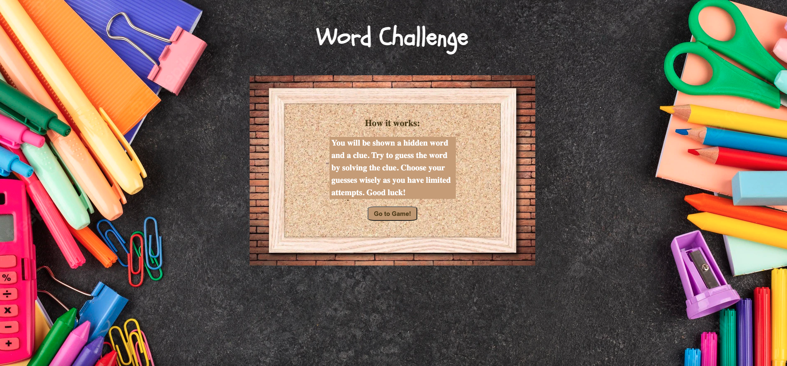
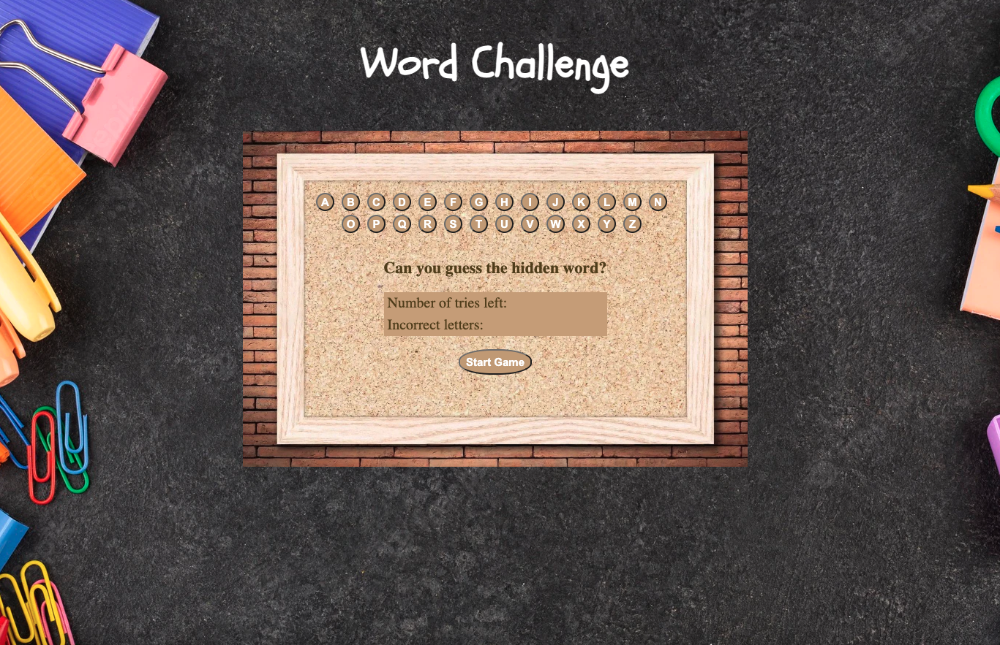
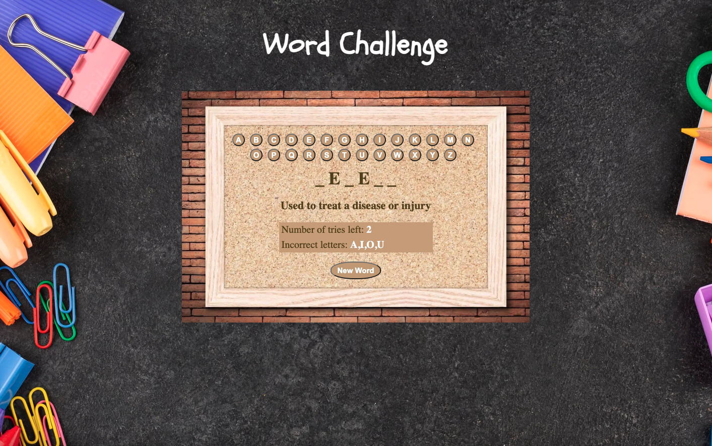

## Date: 7/4/2022

### By: Jason Martinez

### [GitHub](https://github.com/jasonmar08) | [LinkedIn](https://linkedin.com/in/jason-martinez-a79ba7aa)

---

## **_Description_**

A word game built in a week that tests your trivia knowledge.

Can you solve the clues and guess the hidden word? [Play Now!](https://word-challenge-game.surge.sh)

---

## **_Screenshots_**

    <pre>
        &nbsp;&nbsp;&nbsp;&nbsp;&nbsp;&nbsp;&nbsp;&nbsp;&nbsp;
    </pre>

---

## **_Getting Started_**

Once the player starts the game, a clue will propagate in the form of either a question or statement. The challenge is to determine the hidden word and type the guessed letters into the input fields. The player must guess wisely as there are limited chances for guessing letters before they lose their round. When ready to move on to a new word, the player may simply click the "New Word" button and a new word with its hint will be generated.

---

## **_Technologies Used_**

---

## **_Future Updates_**

- [x] ~~Create a "Start Game" button~~
- [x] ~~Add random word generator~~
- [ ] Add option to select different categories of words
- [ ] Add score tracker
- [ ] Add a winner pop-up animation
- [ ] Call an axios API to expand word library

---

## **_Credits_**

**Game Backgrounds: [freepik.com](https://tinyurl.com/wyc5taba) | [123rf.com](https://tinyurl.com/y3nzffyn)**

**Schoolbell Font: [fonts.google.com](https://tinyurl.com/2p8kasss)**

**Technologies: [developerpitstop.com](https://tinyurl.com/5n66xbjh)**
